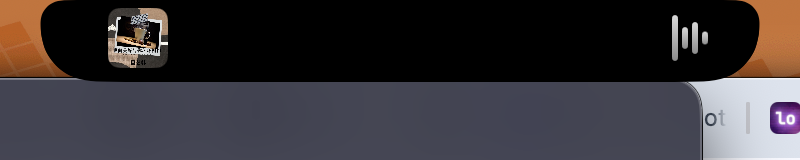
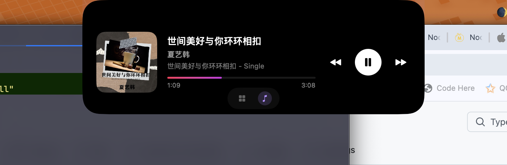
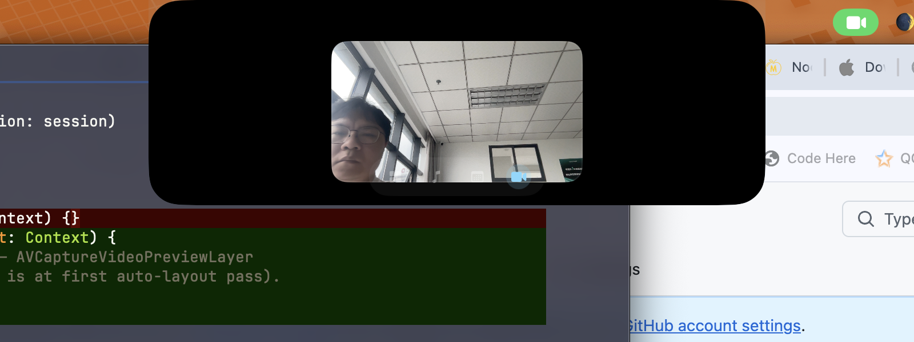

<div align="center">


# Notchy

**Turn your MacBook's notch into a delightful interactive surface.**

[](https://github.com/OtaruTech/notchy/actions/workflows/ci.yml)
[](https://www.apple.com/macos/)
[](https://swift.org)
[](LICENSE)
[](https://github.com/OtaruTech/notchy/releases/latest)

A free, open-source macOS notch utility for Apple-Silicon MacBooks.
NotchNook-style — **HUD takeover (volume/brightness/keyboard)**, Now Playing, **clipboard manager (⌘⇧V)**, file drop tray, AirPods burst, calendar, timer, camera mirror, **system status indicators** (charging wattage, privacy dots, caffeine, network speed, BT batteries) — all from the notch.

**🌐 [otarutech.github.io/notchy](https://otarutech.github.io/notchy/)** — visual tour, screenshots, download.



</div>

---

## ✨ Features

### 🎚 HUD takeover (new in v0.4)

Replace macOS's centre-screen volume / brightness / keyboard backlight HUD with a slim pill anchored on the notch. The signature notch-utility feature.

- **Volume HUD** — F10/F11/F12 (or any system volume change, including Bluetooth headphone inline buttons). CoreAudio listener handles per-channel BT volume correctly.
- **Brightness HUD** — F1/F2; level read via private `CoreDisplay_Display_GetUserBrightness` (dlopen-loaded, no hard framework dep).
- **Keyboard backlight HUD** — F5/F6; level from `AppleHIDKeyboardEventDriverV2` IORegistry.
- Dedicated transparent panel sits above the main notch panel — shows regardless of any other state (during music, clipboard, mirror…).
- 1.5s auto-dismiss (configurable 0.5–4s in Settings).

### 🧰 System status indicators (new in v0.4)

Five small high-frequency glanceables in the dashboard, each individually toggleable in Settings:

- **⚡ Charging wattage** — adapter classification (`MagSafe` / `PD fast` / `PD max` / `trickle`), auto-hides on battery
- **🔴 Privacy dots** — orange mic / green camera dots next to the clock when in use
- **☕ Caffeine** — `⌘⌥K` global hotkey spawns/kills `caffeinate -d -i -m` subprocess
- **📡 Network speed** — `↓ MB/s ↑ KB/s` updated every 2s, hide-when-idle (< 50 KB/s) threshold
- **🔋 BT multi-device battery** — AirPods (L/R/Case), Magic Mouse, Magic Keyboard, Apple Watch, etc. in one row

### 🎵 Now Playing

Album art + waveform flank the physical notch while music plays. Hover to expand into a full player with scrubber, play/pause, prev/next.



- **Works with any music app** — Apple Music, Spotify, Safari/Chrome video, VLC — via the bundled `media-control` adapter that bypasses macOS 15.4+ restrictions on `MediaRemote`
- **Real album artwork** decoded directly from system Now Playing
- **Click album art** → bring source app to front
- **Two-finger horizontal swipe** over the notch → next / previous track
- **Pause keeps controls visible** so you can re-play without re-summoning

### 📋 Clipboard manager (new in v0.3)

Press **⌘⇧V** anywhere — the panel drops down from under the notch with your last 100 copies as a horizontal card row. Paste-app workflow, anchored on the notch instead of floating mid-screen.

- **Six item kinds with kind-aware previews** — text, URL, image, file, colour (hex/rgb), code (auto-detected by line count + punctuation density)
- **Quick paste** — `1`–`9` slots on each card; press the number or click to paste back into the previously-focused app
- **Previous clipboard restored** ~80 ms after the paste so your workflow doesn't lose context (toggleable)
- **Privacy by design** — default-excludes 1Password, Bitwarden, Keychain Access, LastPass; respects the `org.nspasteboard.ConcealedType` UTI hint; all data lives in a local SQLite file (`~/Library/Application Support/tech.otaru.Notchy/clipboard.sqlite`, mode 0600); zero network
- **SHA-256 dedupe** — copy the same string twice and the row is bumped, not duplicated
- **Retention** — auto-purge items older than 7 / 30 / 90 days, or never delete
- **Pause toggle** in the menu bar for one-click hold-off
- **Search** the entire history live as you type
- **Source attribution** — every card shows the app it came from (Safari, Figma, Slack…)

Settings → **Clipboard** tab exposes the full config including an exclusion-list editor with `*` wildcards.

📜 Full PRD: [`docs/specs/2026-05-17-clipboard-prd.md`](docs/specs/2026-05-17-clipboard-prd.md)
📜 Implementation plan: [`docs/plans/2026-05-17-clipboard-plan.md`](docs/plans/2026-05-17-clipboard-plan.md)

### 🗂 Drop Tray

Drag a file onto the notch — panel expands into a temporary tray with AirDrop, Email, and Clear actions. Drag chips back out to any app.

### 🎧 AirPods Burst

Connect AirPods → notch briefly expands showing device name and **L / R / Case** battery percentages. Auto-dismisses after 3s.

### 📅 Calendar

Today's upcoming events at a glance. Click an event to jump to Calendar.app.

### ⏱ Timer / Pomodoro

Start 5 / 15 / 25-minute timers from the status bar menu. Ring progress shows in the notch. Notification fires on completion.

### 📷 Mirror

Webcam preview in the notch. Useful for last-minute check before video calls.



Open via the menu bar `🌒 → Mirror`. The camera turns off automatically when you navigate away from the Mirror tab.

### 📊 Dashboard

Default hover view when nothing else is happening: big clock, today's date, next calendar event, live CPU / battery readouts, plus the new v0.4 indicators (charging / privacy / network / BT / caffeine) below — each gating on its own Settings toggle.

### 🎛 Tab Bar

When multiple widgets are active, tabs appear at the bottom of the expanded panel. **Dashboard is always available** so you can navigate back from any feature.

---

## 📦 Install

### Option 1 — Download the prebuilt release (recommended)

1. Grab the latest `Notchy-vX.Y.Z.zip` from [Releases](https://github.com/OtaruTech/notchy/releases/latest)
2. Unzip and drag `Notchy.app` to `/Applications`
3. **Important — open it the first time.** Notchy is ad-hoc signed (not yet
   notarized by Apple), so macOS Gatekeeper blocks double-click on first launch.
   Pick the fastest path that works on your macOS version:

   #### macOS 15 Sequoia or 14 Sonoma (works on all versions)

   ```bash
   xattr -dr com.apple.quarantine /Applications/Notchy.app
   open /Applications/Notchy.app
   ```

   That one-shot removes the quarantine flag and Notchy will double-click open
   forever after.

   #### Alternative — System Settings (no terminal)

   1. Double-click `Notchy.app` → "Cannot be opened" dialog → click **Done**
   2. Open **System Settings → Privacy & Security**
   3. Scroll to the bottom — you'll see *"Notchy was blocked…"* with an
      **"Open Anyway"** button next to it
   4. Click **Open Anyway** → confirm with your password
   5. Now double-click `Notchy.app` again → the prompt will offer "Open"

   > **Why this is needed**: Notchy is open-source and ad-hoc signed. We
   > don't currently have a paid Apple Developer account ($99/yr), so the
   > app isn't Developer-ID signed or notarized. Both procedures above are
   > Apple's standard escape hatch for trusted-but-unsigned apps; they don't
   > weaken security — you're personally vouching for the app once.

### Option 2 — Build from source

```bash
git clone https://github.com/OtaruTech/notchy.git
cd notchy
brew install xcodegen
xcodegen generate
xcodebuild -project Notchy.xcodeproj -scheme Notchy \
  -configuration Release -derivedDataPath build \
  CODE_SIGN_IDENTITY="-" CODE_SIGNING_REQUIRED=NO build

cp -R build/Build/Products/Release/Notchy.app /Applications/
xattr -dr com.apple.quarantine /Applications/Notchy.app
open /Applications/Notchy.app
```

Or open `Notchy.xcodeproj` in Xcode and hit `⌘R` — when running directly
from Xcode, Gatekeeper doesn't apply.

### Requirements

| Requirement | Version |
|---|---|
| macOS | 14.0 Sonoma or later |
| Hardware | Apple-Silicon MacBook with hardware notch (14"/16" Pro, M2+ Air) |
| Xcode | 16.0 or later |
| `xcodegen` | `brew install xcodegen` |

### Permissions

On first launch you'll be prompted for:

| Permission | Why |
|---|---|
| **Accessibility** | Detect mouse hovering over the notch (global event monitor) |
| **Bluetooth** | Read AirPods battery levels |
| **Calendar** | Show today's events |
| **Camera** | Mirror widget preview |

If a prompt doesn't appear, add Notchy manually in **System Settings → Privacy & Security**.

---

## 🎮 How to use

| Action | Result |
|---|---|
| **F1 / F2 / F5 / F6 / F10 / F11 / F12** | Notchy HUD pill replaces the centre-screen system OSD |
| Hover over the notch (with music playing) | Now Playing expands |
| Hover over the notch (no music) | Dashboard expands |
| **⌘⇧V** anywhere | Open clipboard panel |
| **⌘⌥N** / **⌘⌥M** | Toggle Dashboard / Mirror |
| **⌘⌥K** | Toggle Caffeine (keep Mac awake) |
| In clipboard panel: `1`–`9` | Paste that item directly |
| In clipboard panel: `↩` | Paste selected, restore prior clipboard |
| In clipboard panel: type to search | Filter live across content + source app |
| Click ▶ / ⏸ / ⏪ / ⏩ | Control playback |
| Click album art | Switch to the source app (Music / Spotify / Safari…) |
| **Two-finger horizontal swipe** over the notch | Next / previous track |
| Drag a file onto the notch | Drop tray expands |
| Connect AirPods | 3s burst with battery |
| Click 🌒 menu bar icon → Settings | Open Settings |
| Click 🌒 → **Pause Clipboard Capture** | Hold off the clipboard recorder |
| Click 🌒 → **Start Timer** | Begin 5/15/25-minute timer |
| Click 🌒 → **Mirror** | Open webcam preview |
| `Esc` or click outside | Collapse |

---

## 🧱 Architecture

Notchy is a single-process SwiftUI + AppKit macOS app with a notch-fitting `NSPanel` overlay.

```
┌─────────────────────────────────────────────────────────────┐
│  App Layer        NotchyApp · NotchWindowController         │
├─────────────────────────────────────────────────────────────┤
│  UI Layer         NotchShell · NotchExpandedView · TabBar   │
│                   DashboardView · MediaView · DropView ·    │
│                   AirPodsView · CalendarView · TimerView ·  │
│                   MirrorView · LiveActivityStrip            │
├─────────────────────────────────────────────────────────────┤
│  Feature Layer    @Observable view models — MediaFeature,   │
│                   DropFeature, BTFeature, CalendarFeature,  │
│                   TimerFeature, MirrorFeature, etc.         │
├─────────────────────────────────────────────────────────────┤
│  State            NotchStateMachine · NotchState · Intent   │
├─────────────────────────────────────────────────────────────┤
│  System Bridges   actors — MediaRemoteBridge,               │
│                   IOBluetoothBridge, EventKitBridge,        │
│                   SystemMonitorBridge, DragSession,         │
│                   HotZoneMonitor, ScreenGeometry            │
└─────────────────────────────────────────────────────────────┘
```

**Design principles**

- All system access is wrapped in `actor` bridges, never touched directly from views.
- All UI is `@MainActor`. All view models are `@MainActor @Observable`.
- A single state machine is the source of truth — features push intents, never set state directly.
- Each feature module is independently testable.
- Snapshot tests cover every visual component (`swift-snapshot-testing`).

### How the Now Playing private-API workaround works

macOS 15.4 added entitlement enforcement in `mediaremoted` — third-party apps can no longer call `MRMediaRemoteGetNowPlayingInfo` directly. Notchy bundles [`ungive/mediaremote-adapter`](https://github.com/ungive/mediaremote-adapter) (the `media-control` CLI) inside `Notchy.app/Contents/Resources/MediaControl/`. The adapter spawns `/usr/bin/perl` (whose bundle id `com.apple.perl5` is Apple-signed and entitled) which dynamically loads `MediaRemoteAdapter.framework`. Notchy reads the resulting JSON stream over a pipe. End users don't need to install anything separately.

---

## 🧪 Development

### Build + run

```bash
xcodegen generate
open Notchy.xcodeproj
# ⌘R in Xcode
```

### Run tests

```bash
xcodebuild -project Notchy.xcodeproj -scheme NotchyTests -destination 'platform=macOS' test
xcodebuild -project Notchy.xcodeproj -scheme NotchySnapshotTests -destination 'platform=macOS' test
```

Notchy has ~46 unit tests and ~17 snapshot tests covering the state machine, parsers, geometry, and visual components.

### Project structure

```
Notchy/
├── App/                  — NotchyApp, AppDelegate, NotchWindowController
├── State/                — NotchState, NotchIntent, NotchStateMachine
├── System/               — actor bridges (MediaRemote, Bluetooth, EventKit,
│                          SystemMonitor, DragSession, HotZoneMonitor,
│                          ScreenGeometry)
├── Features/
│   ├── Media/            — Now Playing
│   ├── Clipboard/        — Clipboard manager (store, capture, panel, paste)
│   ├── Lyrics/           — Synced lyrics (optional, lrclib.net)
│   ├── Drop/             — File tray
│   ├── AirPods/          — Bluetooth burst
│   ├── Calendar/         — Today's events
│   ├── Timer/            — Pomodoro
│   ├── SystemMonitor/    — CPU + battery gauge
│   ├── Mirror/           — Webcam preview
│   └── Dashboard/        — Default hover content
├── UI/                   — NotchShell, NotchExpandedView, NotchTabBar,
│                           NotchHint, LiveActivityStrip, DesignTokens,
│                           TapCatcher
├── Settings/             — SettingsView
└── Resources/MediaControl/ — bundled media-control CLI + adapter
```

### Enable verbose debug logging

```bash
defaults write tech.otaru.Notchy notchy.debugLogging -bool true
# Then watch:
tail -f /tmp/notchy.log
```

---

## 🛣 Roadmap

### Shipped recently
- [x] **HUD takeover** (v0.4) — volume / brightness / keyboard backlight pill replaces macOS OSD
- [x] **System indicators** (v0.4) — charging wattage, privacy dots, caffeine (⌘⌥K), network speed, BT multi-device battery
- [x] **Clipboard manager** (v0.3) — Paste.app-style ⌘⇧V panel anchored on the notch
- [x] **Global hotkeys** (v0.2.3) — ⌘⌥N dashboard, ⌘⌥M mirror, ⌘⇧V clipboard, ⌘⌥K caffeine
- [x] **Audio output badge** (v0.2.4) — AirPods / speakers / device name on Now Playing
- [x] **Live progress bar** + **global timer pill** (v0.2.4)

### Shipped in v0.5
- [x] **Meeting copilot** — next-meeting countdown + one-click Join (Zoom/Meet/Lark/Teams/Tencent/Webex)
- [x] **IDE context** — VSCode/Cursor/Xcode/Windsurf project + branch
- [x] **SSH session indicator** — active remote shells with danger regex

### Shipped in v0.6
- [x] **🍅 Pomodoro stats** — persistent log, today/streak/7-day heatmap, dashboard row
- [x] **🔔 Lark / 飞书 unread badge** — Dock AX badge readout in dashboard
- [x] **⌨️ Customisable hotkeys** — record any chord in Settings, instant apply

### Next
- [ ] **Clipboard v2** — pinboards, stack mode, edit-before-paste, plain-text paste hotkey, smart actions per kind
- [ ] **AI task indicator** — Claude Code / Cursor long-running task status
- [ ] Custom widgets / extension SDK
- [ ] Sparkle auto-updater (currently we do a manual GitHub Releases check)
- [ ] Mac App Store distribution path (constrained by private-API usage)
- [ ] Localization

See [open issues](https://github.com/OtaruTech/notchy/issues) for the latest.

---

## 🤝 Contributing

Pull requests welcome! See [CONTRIBUTING.md](CONTRIBUTING.md).

Quick start:
1. Fork and clone
2. `xcodegen generate && open Notchy.xcodeproj`
3. Create a feature branch (`git checkout -b feat/your-feature`)
4. Make sure tests pass (`xcodebuild ... test`)
5. Open a PR

---

## 🙏 Acknowledgments

- [NotchNook](https://lo.cafe/notchnook) by [lo.cafe / @kinark](https://lo.cafe) — the reference app this clone was modeled after
- [ungive/mediaremote-adapter](https://github.com/ungive/mediaremote-adapter) — the brilliant workaround that brings Now Playing back to third-party apps on macOS 15.4+
- [pointfreeco/swift-snapshot-testing](https://github.com/pointfreeco/swift-snapshot-testing) — visual regression tests
- [yonaskolb/XcodeGen](https://github.com/yonaskolb/XcodeGen) — declarative `.xcodeproj` generation

---

## 📜 License

Notchy is [MIT licensed](LICENSE).

The bundled `media-control` CLI is BSD-3-Clause licensed; see [its license](Notchy/Resources/MediaControl/README.md).
